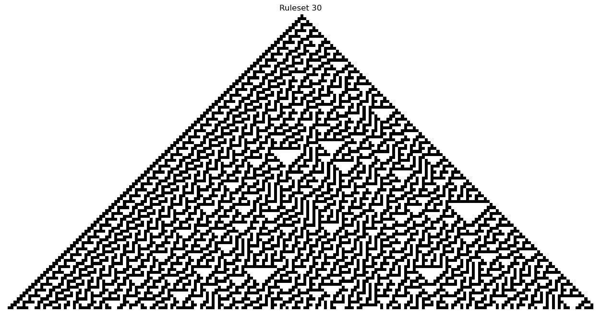
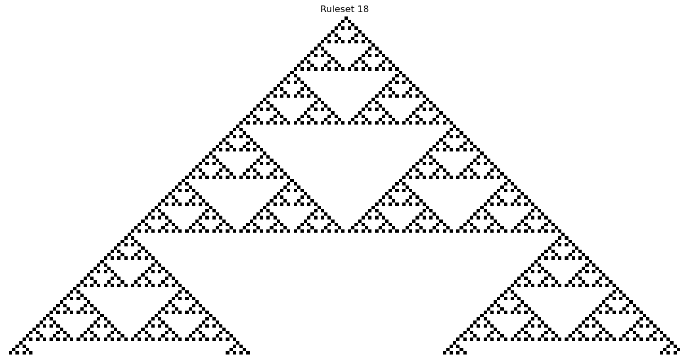
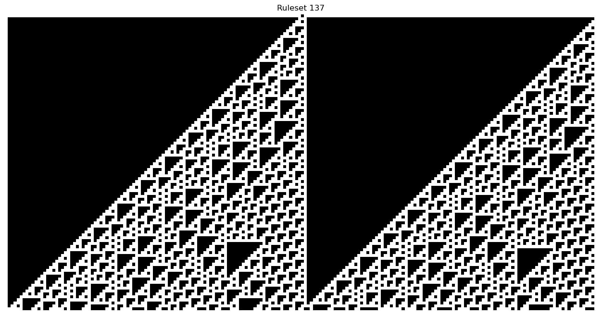
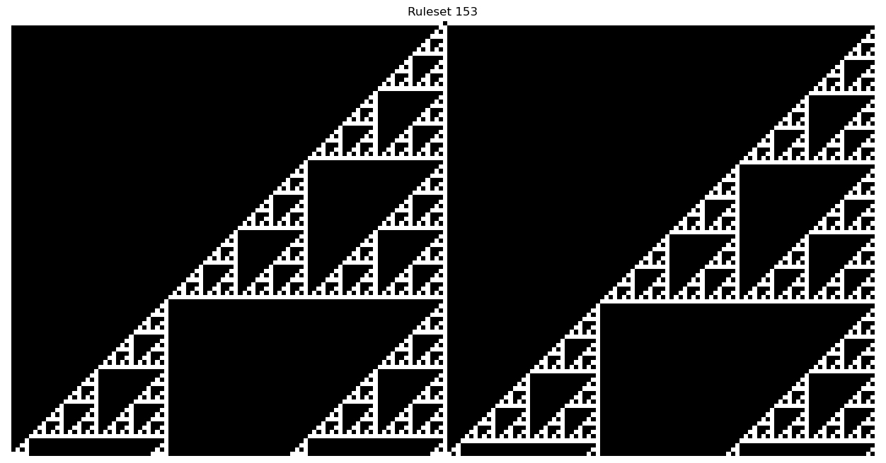
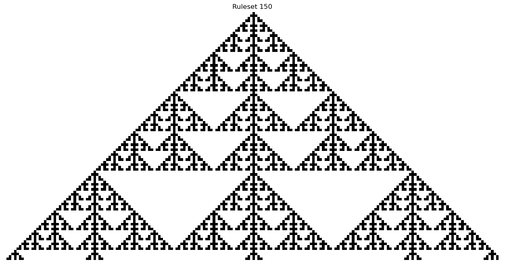
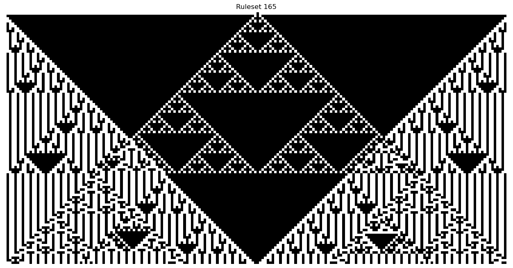

<h1 align="center">Cellular Automata</h1>

 Cellular automata can be defined as a collecton of cells. It consists of a regular grid of cells, each of these cell is existing in a finite state, The simplest states can be for example "on" or "off". 
For each cell we define a particular neighbourhood and we also define a set of rules which decide how the next generation of cells will be produced.
 
The rule for updating the cell depends upon the current state of the cell and its neighbors.

<b>Why is Cellular Automata cool you ask?</b> Cellular Automata demonstrates the remarkable ability to create complex behaviour from simple rules. These complex structures can be observed in our day to day life and who knows how simple the structure that produce them might be :smile: 

 
<h1 align="center">Stephen Wolfram's work on Cellular Automata</h1>

 This Repository concentrates on Stephen's Wolfram work on 1-d cellular automata. He recorded some complex yet simple structures. That makes you question how can something so simple produce something so complex.

 Rules followed by 1-D Automata used in this Repository: 

<ul>
<li> We have two states 0 and 1 </li>
<li> <b> Neighbors:</b> for each cell we consider its left and right cell as its neighbors</li>
</ul>

  
<h1 align="center">Result images and its corresponding Rulesets</h1>

<b>Not all Rulesets will produce valuable results but the one which do produce are truly beautiful to look at. Take a look at some of these below:</b>
 

    
    
 

  

<b>I am sure after seeing this you will definetly believe that some simple rules can give rise to such complex behaviours its truly beautiful !</b>

<!--  -->

<h1 align="center">References</h1>
<ul>
<li><a href="https://www.wolframscience.com/nks/">Stephen Wolfram's Book</a></li>
<li><a href="https://youtu.be/VguG_y05Xe8" >Cellular Automata and Rule 30 (Stephen Wolfram) | AI Podcast Clips -> Lex Fridman</a></li>
<li><a href="https://mathworld.wolfram.com/ElementaryCellularAutomaton.html">Elementary Cellular Automaton</a></li>
</ul>

<h1 align="center">Found a Bug</h1>

 
If you find any bug or have any feature request, feel free to raise an issue or contact me on : <a href="mailto:divymohanrai@gmail.com"> Divy Mohan Rai </a>

If you want to contribute to this project please create a pull request.

#### If you liked ♥ this project, please hit that **STAR** button.
